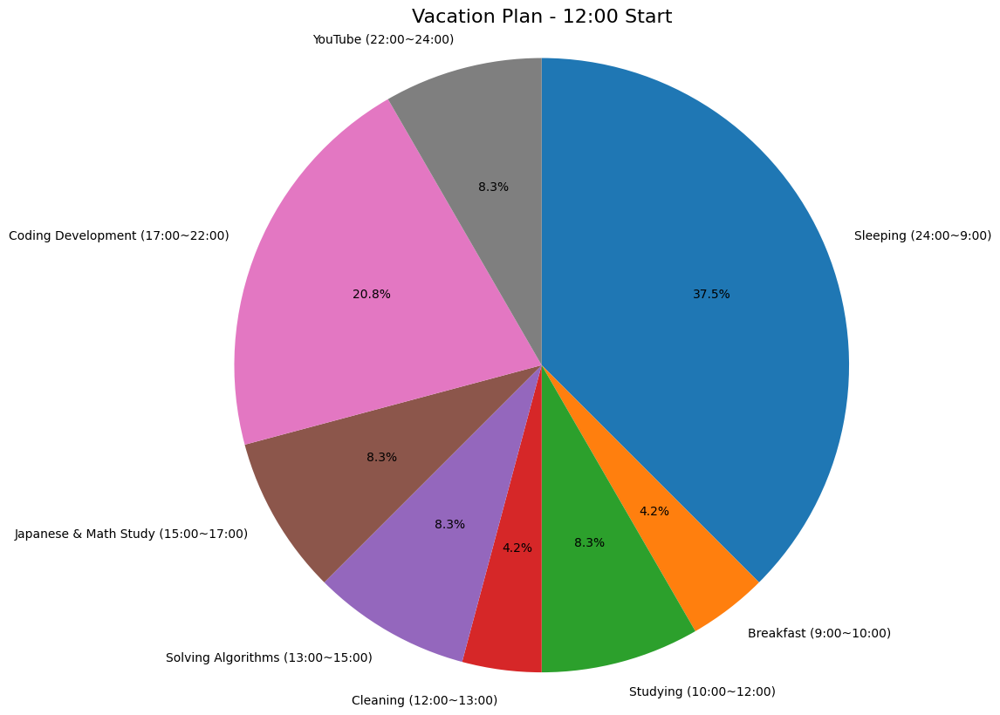
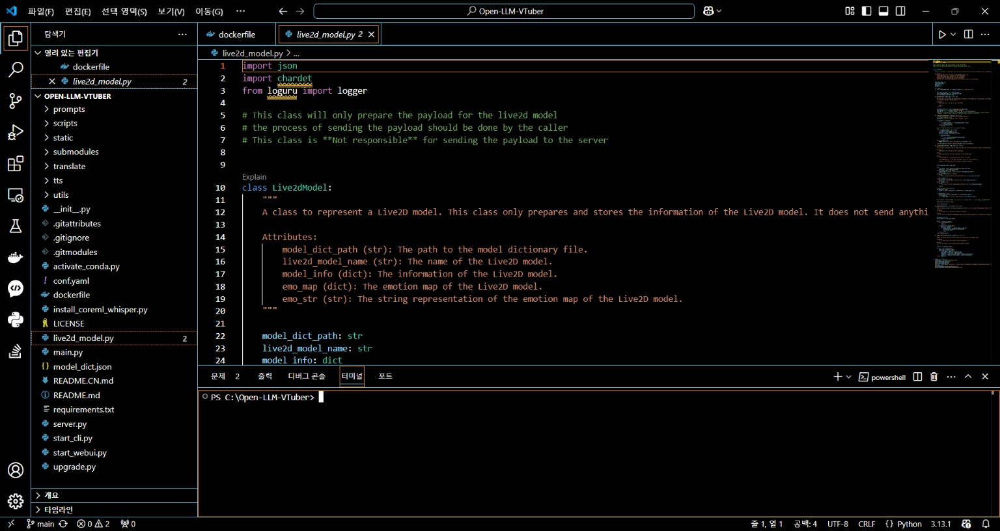
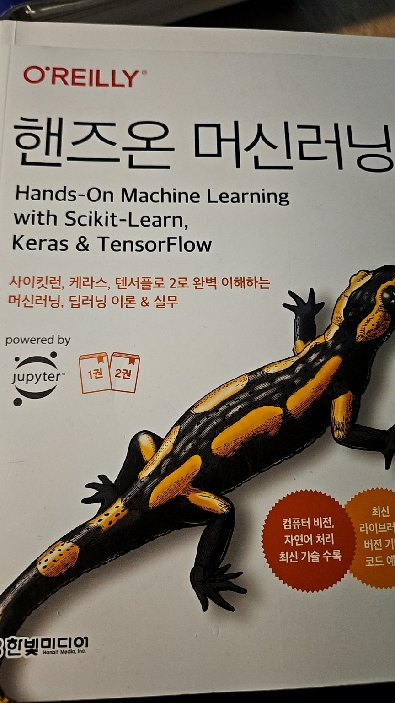
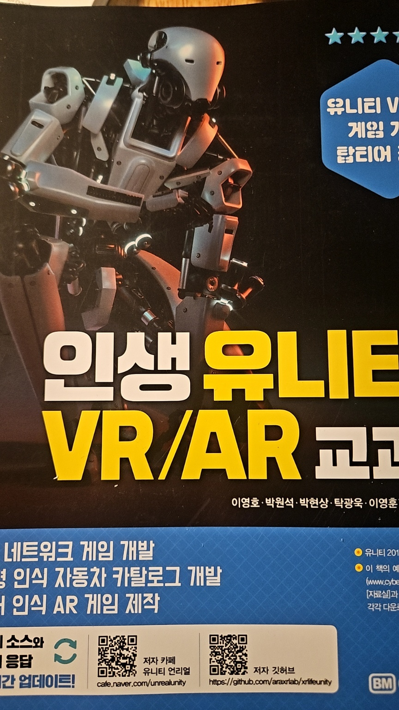
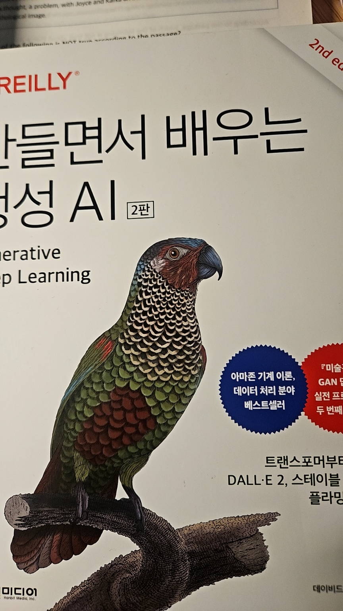

# 인간과 공동체 방학 계획 과제 제출용
> ㅊㄱㅂ 교수님

# 📅 1월~3월 학습 계획

## 🟦 1월
# 1. VR & C# 학습
### Udemy  

### Oculus Developer Guide  

# 2. 알고리즘 공부  
   - **Codeforces**  
       
     - [My Codeforces Profile](https://codeforces.com/profile/YourUsername)  
   - **Programmers**  
       
     - [My Programmers Profile](https://programmers.co.kr/learn/challenges?tab=all_challenges)

## 🟨 2월
- **LLM 모델 학습 프로젝트**
  

3. 일본어 학습
### JLPT 일본어 학습

## 🟥 3월
1. 프로젝트 통합 및 정리
---
## 하고 있는 활동

## 추후 도전
- **SCPC 알고리즘 도전**
  

---
## 🗓 학습 계획 (1월 ~ 3월)
| Month      | 목표                      | 비고                                 |
|------------|---------------------------|--------------------------------------|
| **January**| Unity & VR 기초 학습       | [Unity VR 튜토리얼](https://learn.unity.com/) |
| **February**| Codeforces 알고리즘 챌린지 | 주 5문제 목표                        |
| **March**   | AR 프로젝트 제작           | [Unity AR Foundation](https://learn.unity.com/tutorial/ar-foundation) |

## 📈 알고리즘 실적

### 🔹 
| Ai 경진대회         | LV  | Rank   |
|--------------------|---------|--------|
|                    | Lv.4       |   |
### 🔹 Codeforces
| Contest Name       | Rating  | Rank   |
|--------------------|---------|--------|

### 🔹 Programmers
| Challenge Name          | Difficulty | Score  |
|-------------------------|------------|--------|

---

